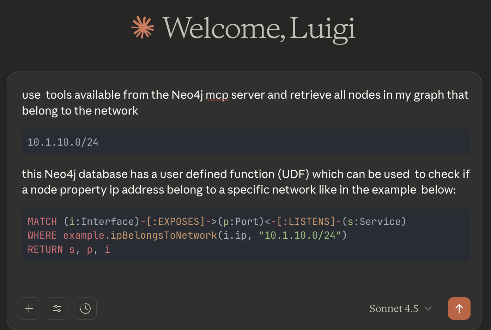
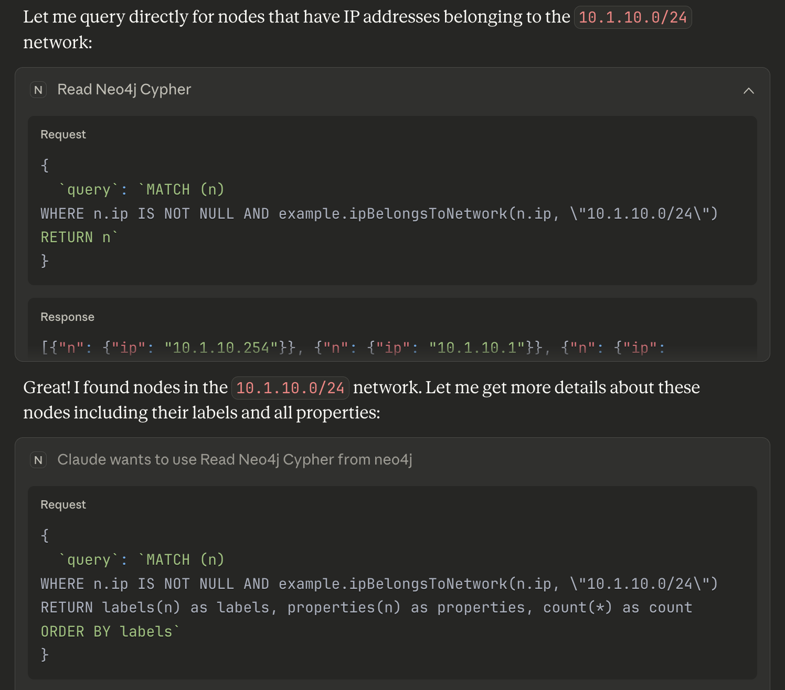
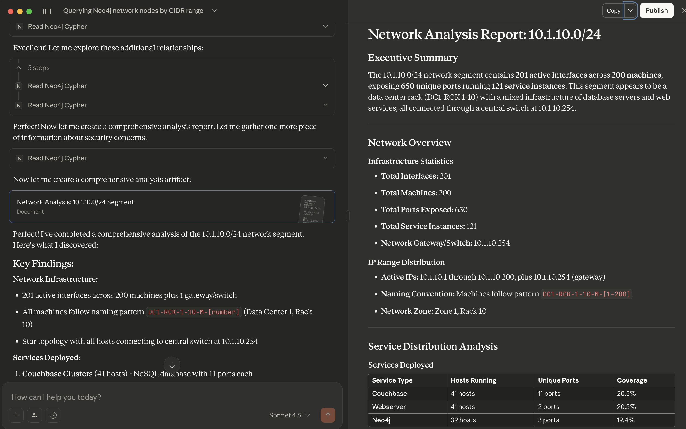

[](https://github.com/looeejee/neo-udf-cidr-check/actions/workflows/maven.yml)

# User Defined Function for Neo4j: IP Address Network Verification

This project is designed to explore how it is possible to extend Neo4j's capabilities by implementing a User Defined Function (UDF) that checks if an IP address belongs to a specified network segment. It's meant as an example for developers looking to integrate network validation within their Neo4j graph databases.

For more information on Neo4j User Defined Functions, visit the official documentation page:

https://neo4j.com/docs/cypher-manual/current/functions/user-defined/

## Project Overview

The UDF enables users to verify whether the `ip` property of a node (specifically a server node) belongs to a defined network. This can be especially useful in network management applications, monitoring systems, or any scenario where IP allocation must be verified against predefined subnets.

## Example Usage

In this example, we assume that your Neo4j database contains several server nodes, each with an `ip` property representing its IP address.

### 1. Node Representation


You can visualize the nodes in your database with the label `Server`, which represent various servers.

### 2. Display IP Addresses

To view the IP addresses stored in your nodes, you can execute a query that displays a table of these nodes and their properties:


### 3. Using the UDF

The example below indicate how to utilize the UDF to check if a node property containing information on an ipv4 address belongs to a specific network. 

### EXAMPLE-1:

In this example we perform a query to filter nodes based on a specific condition (e.g., matching labels and names) and then check if the associated IP address belongs to a specified network segment.
To find all nodes with the label `:Server` that contain `web-server` in their `name` property and verify if their `ip` addresses belong to the network `10.10.0.0/16`, you would execute the following query:

```cypher
MATCH (s:Server)
WHERE s.name CONTAINS 'web-server'
RETURN s.ip, example.ipBelongsToNetwork(s.ip, '10.10.0.0/16') AS belongsToNetwork
```


### EXAMPLE-2:

Filter nodes based on whether the value of the node property IP belongs to the specified network

```cypher
MATCH (s:Server) WHERE example.ipBelongsToNetwork(s.ip, '192.168.10.0/28') RETURN s
```


### EXAMPLE-3:

For this example we create a more complex graph representing a large network. The dataset used for this example was extracted from the existing repository:

https://github.com/neo4j-graph-examples/network-management

For the scope of this Project a docker image was created to import the dataset and configure the UDF that will be used to filter Nodes based on the value of IP node property.

To build and run this image locally, checkout this repository and build the `.jar` file by running 

```mvn clean install``` 

then execute the docker commands:

```
docker build -t neo-udf-ip-check:1.0 .

docker run -it -p 7474:7474 -p 7687:7687 --env=NEO4J_AUTH=neo4j/<PASSWORD> neo-udf-ip-check:1.0
```

>**NOTE**: if building using a neo4j-enterprise docker image, it is necessary to add the variable `--env=NEO4J_ACCEPT_LICENSE_AGREEMENT=yes`

Once the Container is Up and running, connect to it by opening a web browser and access Neo4j Browser via the URL `https://localhost:7474`

Login using the credentials defined in the step above.


Once logged in we can review and familiarize ourselves with the nodes and relationships contained in the graph using the Cypher command:

```cypher
CALL db.schema.visualization();
```


We can then test the UDF to filter Interfaces based on whether their node property `ip` belongs to a specific network:

*example*

```cypher
MATCH (i:Interface)-[r]-(d) WHERE example.ipBelongsToNetwork(i.ip,"10.4.1.0/28") RETURN i AS InterfaceIP, r as REL, d AS Device
```

OUTPUT


## One Step Forward: Use the UDF and Neo4j MCP server to perform an analysis of a network segment with the help of a LLM.

We can take this Project one step further by integrating the UDF function that we have defined and use it with Neo4j MCP Server to be able to perform a detailed network analysis with the help of a LLM.

For this test I have used Claude Desktop and the `neo4j-mcp` MCP Server. For more information, visit the pages:

https://github.com/neo4j/mcp

Make sure that the container that includes the UDF and the demonstrative network data is running via

```
docker run -it -p 7474:7474 -p 7687:7687 --env=NEO4J_ACCEPT_LICENSE_AGREEMENT=yes --env=NEO4J_AUTH=neo4j/<PASSWORD> <image-name>:<tag>
```

- Step 1: Configure Claude Desktop to use the `neo4j-mcp` server to access the tools exposed by the MCP Server to run Cypher queries on the network graph stored in my Neo4j Server

Update the `claude_desktop_config.json` file to include the configuration for the MCP server:

```
{
  "mcpServers": {
    "neo4j-mcp": {
      "type": "stdio",
      "command": "neo4j-mcp",
      "args": [],
      "env": {
        "NEO4J_URI": "bolt://localhost:7687",
        "NEO4J_USERNAME": "neo4j",
        "NEO4J_PASSWORD": "password",
        "NEO4J_DATABASE": "neo4j",
        "NEO4J_READ_ONLY": "true",
        "NEO4J_TELEMETRY": "false",
        "NEO4J_LOG_LEVEL": "info",
        "NEO4J_LOG_FORMAT": "text",
        "NEO4J_SCHEMA_SAMPLE_SIZE": "100"
      }
    }
  }
}
```

Once the `claude_desktop_config.json` file is updated with the mcp server configuration, save it and restart Claude Desktop.

You can now begin a new chat session and Claude Desktop which access the tools that are made available by the mcp server.

### Example:

We can ask the LLM to retrieve all nodes that belong to the network `10.1.10.0/24` and instruct the LLM to use the User Defined Function that we have created in this project:






# Final Result And Detailed Network Analysis as Returned by the LLM



## Network Analysis Report: 10.1.10.0/24

### Executive Summary

The 10.1.10.0/24 network segment contains **201 active interfaces** across **200 machines**, exposing **650 unique ports** running **121 service instances**. This segment appears to be a data center rack (DC1-RCK-1-10) with a mixed infrastructure of database servers and web services, all connected through a central switch at 10.1.10.254.

---

## Network Overview

### Infrastructure Statistics
- **Total Interfaces:** 201
- **Total Machines:** 200  
- **Total Ports Exposed:** 650
- **Total Service Instances:** 121
- **Network Gateway/Switch:** 10.1.10.254

### IP Range Distribution
- **Active IPs:** 10.1.10.1 through 10.1.10.200, plus 10.1.10.254 (gateway)
- **Naming Convention:** Machines follow pattern `DC1-RCK-1-10-M-[1-200]`
- **Network Zone:** Zone 1, Rack 10

---

## Service Distribution Analysis

### Services Deployed

| Service Type | Hosts Running | Unique Ports | Coverage |
|-------------|---------------|--------------|----------|
| **Couchbase** | 41 hosts | 11 ports | 20.5% |
| **Webserver** | 41 hosts | 2 ports | 20.5% |
| **Neo4j** | 39 hosts | 3 ports | 19.4% |

### Port Analysis by Category

#### Web Services (2 ports)
- **Port 80 (HTTP):** Exposed on 41 hosts
- **Port 443 (HTTPS):** Exposed on 41 hosts

#### Database - Neo4j (3 ports)
- **Port 7473 (HTTPS):** Exposed on 39 hosts - Browser HTTPS interface
- **Port 7474 (HTTP):** Exposed on 39 hosts - Browser HTTP interface  
- **Port 7687 (Bolt):** Exposed on 39 hosts - Native protocol

#### Database - Couchbase (11 ports)
Exposed on 41 hosts across multiple ports:
- **Port 4369:** Erlang Port Mapper Daemon
- **Port 8091:** Web Administration Console (HTTP)
- **Port 8092:** Couchbase API (HTTP)
- **Port 11207:** Internal/External Bucket Port (SSL)
- **Port 11209:** Internal Data Port
- **Port 11210:** Internal/External Bucket Port
- **Port 11211:** Memcached Port
- **Port 11214:** SSL XDCR Data
- **Port 11215:** Internal XDCR Data
- **Port 18091:** Web Administration Console (HTTPS)
- **Port 18092:** Couchbase API (HTTPS)

---

## Network Topology

### Connectivity Pattern
All 200 interfaces connect to a central gateway/switch at **10.1.10.254**, creating a star topology:

```
                    ┌─────────────────┐
                    │   10.1.10.254   │
                    │  Switch/Gateway │
                    └────────┬────────┘
                             │
              ┌──────────────┼──────────────┐
              │              │              │
        ┌─────▼─────┐  ┌────▼────┐  ┌─────▼─────┐
        │ 10.1.10.1 │  │10.1.10.2│  │ 10.1.10.3 │
        │ Machine 1 │  │Machine 2│  │ Machine 3 │
        └───────────┘  └─────────┘  └───────────┘
              │              │              │
         (continues for all 200 machines)
```

### Upstream Connections
- **Switch:** 10.1.10.0/16 (Rack 10)
- **Network Zone:** 10.1.0.0/8 (Zone 1)

---

## Host Classification

### By Service Profile

**High-Exposure Hosts (13 ports exposed):** 41 machines
- Running both Couchbase AND Webserver services
- Examples: 10.1.10.10, 10.1.10.11, 10.1.10.13, 10.1.10.103, 10.1.10.105, etc.
- Service mix: 11 Couchbase ports + 2 Web ports

**Medium-Exposure Hosts (3 ports exposed):** 39 machines  
- Running Neo4j database services only
- Examples: 10.1.10.5, 10.1.10.8, 10.1.10.20, 10.1.10.23, 10.1.10.25, etc.
- Service mix: 3 Neo4j ports (HTTP, HTTPS, Bolt)

**Idle/Infrastructure Hosts (0 services):** 1 machine
- 10.1.10.254 (Gateway/Switch - no exposed services)

**Unassigned/Reserved Hosts:** 119 machines
- Running isolated single-purpose roles (likely part of larger clusters)

---

## Security Analysis

### Risk Assessment

#### 🔴 High Risk Findings

1. **Unencrypted Web Traffic**
   - Port 80 (HTTP) exposed on 41 hosts without apparent redirect to HTTPS
   - Recommendation: Enforce HTTPS-only with HTTP→HTTPS redirects

2. **Database Management Interfaces Exposed**
   - Couchbase admin console on ports 8091 (HTTP) and 18091 (HTTPS)
   - Neo4j browser on ports 7474 (HTTP) and 7473 (HTTPS)
   - Recommendation: Restrict to VPN/internal network or implement IP whitelisting

3. **Multiple Database Ports Open**
   - 11 Couchbase ports per host (normal for clustering but increases attack surface)
   - Recommendation: Review necessity of all ports, implement firewall rules

#### 🟡 Medium Risk Findings

1. **Port Standardization**
   - Mixed HTTP/HTTPS exposure patterns
   - Recommendation: Standardize on HTTPS-only for all admin interfaces

2. **Service Concentration**
   - All traffic routes through single switch (10.1.10.254)
   - Recommendation: Consider redundancy for high availability

---

## Network Relationships

### Relationship Types Discovered

| Relationship | Count | Description |
|-------------|-------|-------------|
| `EXPOSES` | 944 | Interface → Port connections |
| `CONNECTS` | 400 | Interface ↔ Interface links (to gateway) |
| `ROUTES` | 202 | Machine/Switch/Network → Interface routing |

### Network Hierarchy

```
Network (Zone 1: 10.1.0.0/8)
    └── Switch (Rack 10: 10.1.10.0/16)
            └── Interface (10.1.10.254)
                    └── CONNECTS ← 200 Machine Interfaces
                            └── Machine (DC1-RCK-1-10-M-[1-200])
```

---

## Recommendations

### Immediate Actions
1. **Audit Exposed Services:** Verify all 121 service instances require external access
2. **Implement TLS:** Disable HTTP (80, 7474, 8091) in favor of HTTPS variants
3. **Network Segmentation:** Consider VLANs for database vs. web tiers
4. **Access Control:** Implement firewall rules restricting admin console access

### Short-term Improvements  
1. **Monitoring:** Deploy network monitoring on 10.1.10.254 to track all traffic
2. **Service Documentation:** Document the role of each machine/service combination
3. **Cluster Analysis:** Map Couchbase and Neo4j cluster topologies
4. **Load Balancing:** Consider load balancer for web services (41 hosts with web exposed)

### Long-term Strategy
1. **Zero Trust Architecture:** Implement service mesh for inter-service communication
2. **Automation:** Use infrastructure-as-code for consistent configuration
3. **Redundancy:** Add secondary switch/gateway for failover capability
4. **Security Hardening:** Regular vulnerability scanning and patching

---

## Summary Statistics

### Port Exposure Distribution
- **No Services:** 1 interface (0.5%)
- **1-5 Ports:** 159 interfaces (79.1%) - Primarily Neo4j hosts
- **10+ Ports:** 41 interfaces (20.4%) - Couchbase + Webserver hosts

### Service Density
- **Average ports per active host:** 3.25
- **Maximum ports per host:** 13 (Couchbase + Webserver combination)
- **Service instance density:** 60.5% of hosts run services

---

*Report generated from Neo4j graph database analysis of network segment 10.1.10.0/24*


## Does it really brings any benefits to use this UDF?

I have asked the LLM to run some tests on the graph database used in this project to verify whether the UDF introduces any tangible benefit to perform the desired newtork analysis. 
The ouput from the test returned by the LLM is available in the files `udf_comparison.md` and `udf_comparison_report.md`

One important note, which I belive is relevant to mention is that the following related to performance consideraions:

```
String Prefix Performance

Query Time: Fast (sub-second)
Scan Type: Full table scan OR index scan if string index exists
Scalability: O(n) with potential index optimization
Index Usage: Can benefit from string prefix indexes
```

This is particularly important to consider, as performance will scale with O(n) = n, where n is the number of interfaces. Thus, the UDF  performance may be affected in very large graphs.